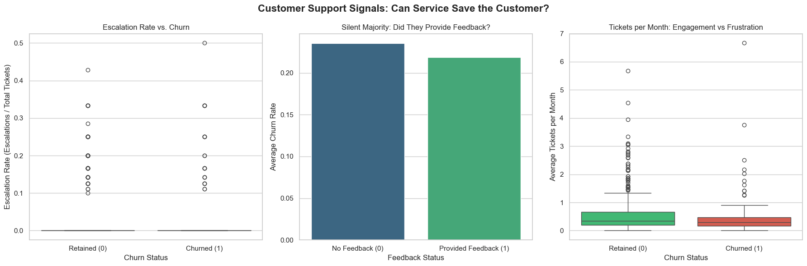
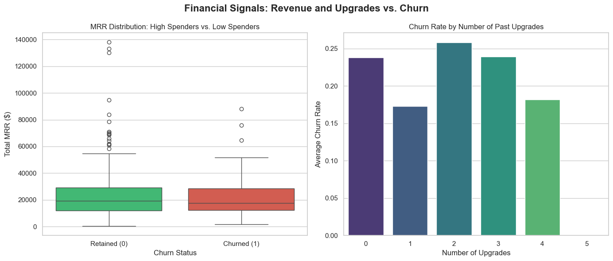
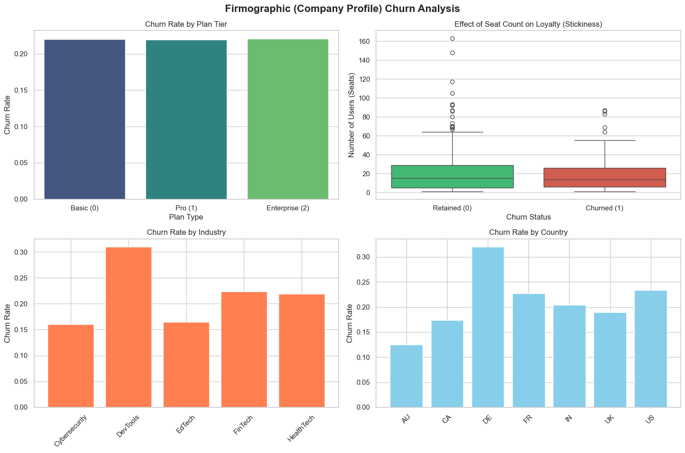
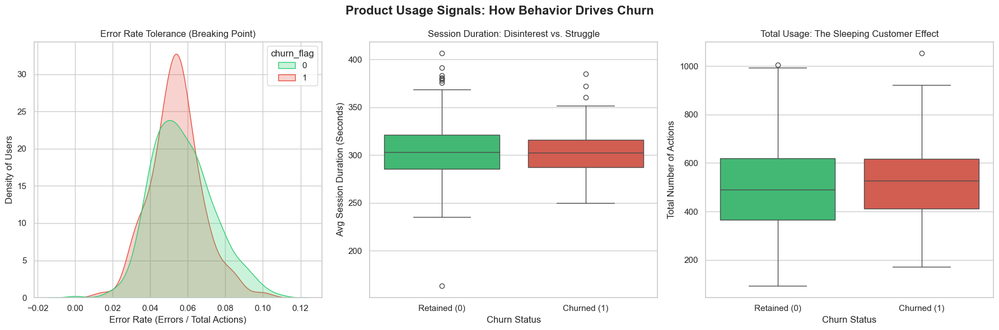

# SaaS Customer Churn Analysis & Prediction

A comprehensive end-to-end data science project focused on identifying customer churn patterns for a B2B SaaS platform. This project covers everything from raw data processing and feature engineering to exploratory data analysis (EDA) and predictive modeling.

##  Project Overview
Customer churn is a critical metric for SaaS businesses. This project aims to analyze historical customer data to understand **why** customers leave and to build a machine learning pipeline to **predict** potential churners before they cancel their subscriptions.

## Tech Stack
- **Languages:** Python (Pandas, NumPy, Matplotlib, Seaborn)
- **Database:** SQL (Data aggregation and merging)
- **Machine Learning:** Scikit-Learn (Logistic Regression, Random Forest)
- **Version Control:** Git & GitHub

## 📂 Project Structure
```text
saas_data_analysis/
│
├── data/
│   ├── raw/                 # Original, untouched datasets
│   └── processed/           # Final master table used for modeling
│
├── notebooks/
│   ├── 01_data_prep.ipynb   # SQL-style merging and initial cleaning
│   ├── 02_feature_eng.ipynb # Deriving business metrics (Tenure, Error Rates)
│   ├── 03_visualization.ipynb # Detailed EDA and Insight generation
│   └── 04_modeling.ipynb    # ML experiments (Baseline vs. Advanced)
│
└── README.md

## Data Engineering & Features
Combined multiple data sources (Accounts, Subscriptions, Feature Usage, Support Tickets) to create a Master Feature Table. Key engineered features include:

Tenure: Number of days since signup.

Error Rate: Ratio of system errors to total usage actions.

Support Intensity: Tickets per month and escalation rates.

Financial Stickiness: MRR (Monthly Recurring Revenue) and history of plan upgrades.









## Key Insights from EDA

Through visualization, several critical business patterns were discovered:

Industry Risk: The DevTools sector showed significantly higher churn rates (>30%) compared to Cybersecurity or EdTech.

Geographical Variance: Customers in Germany (DE) exhibited higher churn, suggesting potential localization or competitive pressure issues in that market.

Usage Paradox: Retained customers actually opened more support tickets and had more usage actions, indicating that engagement (even for support) is a sign of platform stickiness.

Breaking Point: Churn risk spikes significantly when the Error Rate exceeds 5.5%.

## Modeling & Results
I experimented with two different modeling approaches:

Logistic Regression (Baseline): Used as an interpretable starting point.

Random Forest (Advanced): Used to capture non-linear relationships and interactions between features.

The "Signal Problem" Finding

Both models achieved a ROC-AUC Score of ~0.61 and CV-AUC of ~0.50.

Senior Analysis: While the accuracy appears "okay" (~78%) due to class imbalance, the low AUC indicates a lack of predictive signal in the current feature set. The correlation matrix confirmed that the strongest feature only had a 0.11 correlation with churn.

Conclusion: The churn behavior in this dataset is highly stochastic (random) relative to the captured metrics. In a real-world scenario, this finding is a signal to the product team that we need to collect different types of data (e.g., Competitor pricing, Exit surveys, or Qualitative feedback) to explain churn.


##How to Run

git clone [https://github.com/doganbilir/saas_churn_analysis.git](https://github.com/yourusername/saas_churn_analysis.git)

pip install -r requirements.txt